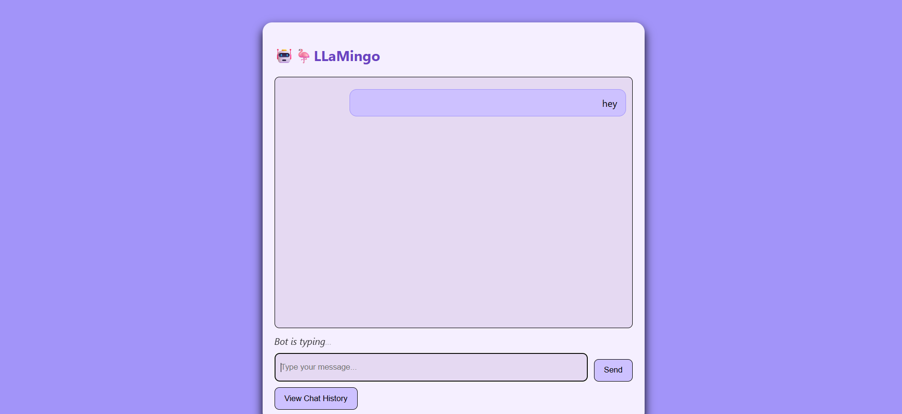
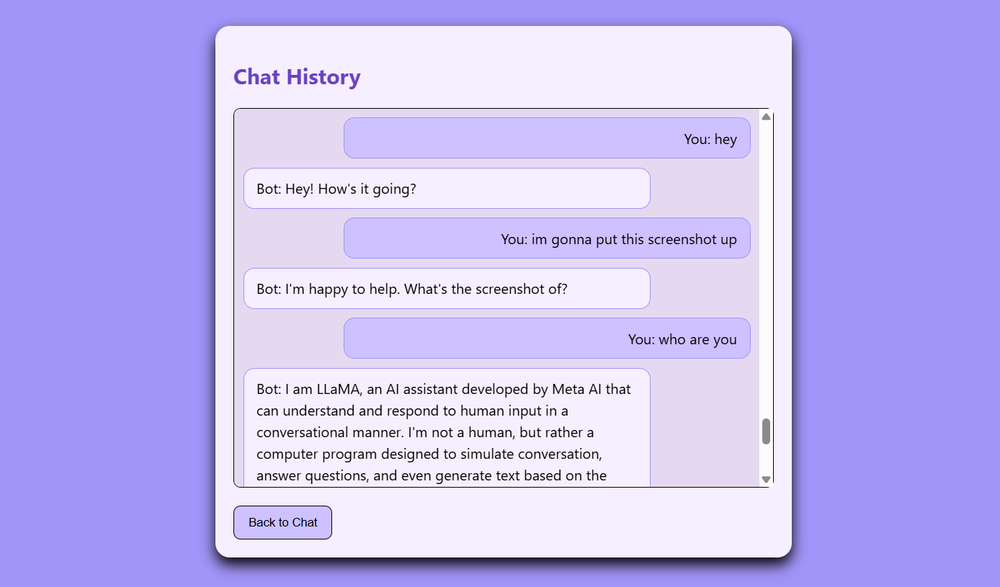

# LLaMingo – A Local AI Chatbot Powered by Ollama

Llamingo is a sleek, local AI chatbot web app built using Flask and powered by the LLaMA 3 model from [Ollama](https://ollama.com/). It provides a friendly chat interface for general-purpose conversations, running entirely offline on your machine.

---

## Features

- Real-time chat interface with typing indicator
- View your chat history
- Modern UI with chat bubbles 
- Powered by Ollama's LLaMA 3 model running locally
- Fast and private (no internet required for AI)

---

## Tech Stack

**Backend:**  
- Python  
- Flask  
- SQLite  
- Ollama (LLaMA 3 model)

**Frontend:**  
- HTML  
- CSS  
- JavaScript (vanilla)  
- Jinja2 templating (via Flask)

---

## Screenshots

### Chat Interface


### Chat History 


---


## Installation & Setup Guide

### Prerequisites

- Python 3.7+
- Git
- [Ollama](https://ollama.com/) installed and set up (includes LLaMA 3)

### Steps

1. **Clone the repository**

   ```bash
   git clone https://github.com/Ariyan-25/llamingo.git
   cd llamingo
